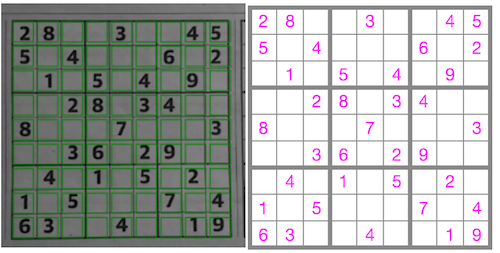

# Description

I want to create a web app to scan and solve a Sudoku puzzle.
The hard part is scanning the puzzle which is what I am attempting to do in this repo.
My plan is to use [TensorFlow.js](https://www.tensorflow.org/js) to:

* Train a model to recognise the bounding box of a Sudoku puzzle
* Calculate the grid squares from the bounding box
* Train a model to detect blank grid squares
* Train a model to recognise digits 1-9

## Instructions

* Open https://sudoku-scanner.herokuapp.com/
* Click 'Load' under 'Training - Blanks'
* Click 'Load' under 'Training - Digits'
* Click 'Predict Test Data' under 'Predictions - Blanks and Digits'
* The results of attempting to recognise the test images are displayed
* Currently, I need to provide the bounding box (via the [test data](data/test-data.json))
* It does the following:
    * Uses the provided bounding box to calculate the positions of the grid squares
    * Crops the grid squares from the image of the grid
    * Uses the 'blanks' model to distinguish between blanks and digits
    * Uses the 'digits' model to recognise the digits
* A big red cross means that it failed to convincingly distinguish between blanks/digits

# TODO

* Train a model to recognise the bounding box of a Sudoku puzzle
    * This is not going very well!
        * Currently, the bounding box prediction seems to be the same for all images
        * I think my training data images are too similar
        * I guess I need images with a variety of sizes/placements of the grid
        * Maybe the target should be the coords for the start/end of the 4 inner major box lines instead of the bounding box ?
* ~~Train a model to distinguish between blank and non-blank grid squares~~
* ~~Train a model to recognise digits 1-9~~
* ~~Add the ability to save and load named sets of trained model data~~
* Bring all the parts together
    * Currently, it does a reasonable job of reading the grid if I provide the bounding box
    * The remaining work is to be able to detect the bounding box
* Split the current single index.html page into separate pages for:
    * capturing and saving images for training, validation and test
    * training and saving models for recognising bounding boxes, blanks and digits
    * loading trained models and using them to scan newly captured images

# Links

* [TensorFlow.js](https://www.tensorflow.org/js)
* sudoku-buster
  * [GitHub](https://github.com/taylorjg/sudoku-buster)
  * [Heroku](https://sudoku-buster.herokuapp.com/)
